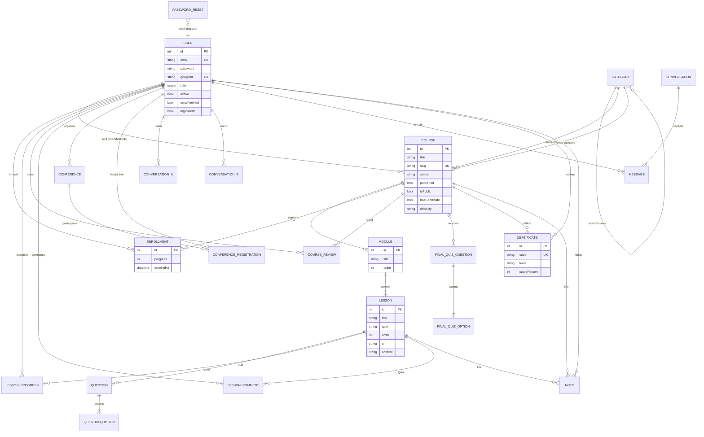
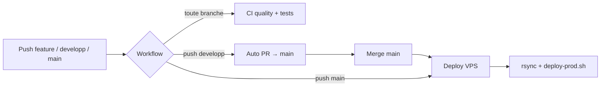

# Architecture technique — MCD, outils, Docker & GitHub

| | |
|---|---|
| **Projet** | EduPulse LMS |
| **Source schéma** | `prisma/schema.prisma` |
| **Date** | 29 juillet 2026 |

Documents liés : [Présentation & équipe](./PRESENTATION_ET_EQUIPE.md) · [Cahier des charges](./CAHIER_DES_CHARGES.md)

---

## 1. MCD — Modèle Conceptuel de Données

Base : **PostgreSQL 15** · ORM : **Prisma 7** · Migrations versionnées dans `prisma/migrations/`.

### 1.1 Diagramme entité-association (Mermaid)



### 1.2 Dictionnaire des entités

| Entité | Rôle métier | Attributs clés | Relations |
|---|---|---|---|
| **User** | Compte (Apprenant / Formateur / Admin) | email, password?, googleId?, role, active, loginAlerts | Auteur de cours/conférences ; inscriptions ; messages ; notes ; certificats |
| **PasswordReset** | Jeton de réinit. MDP | email, token, expiresAt, used | Lié logiquement à User via email |
| **Category** | Catégorie / sous-catégorie | name, slug, order, parentId? | Auto-référence parent/enfants ; liée aux Course |
| **Course** | Cours LMS | title, slug, status (DRAFT…), published, isPublic, hasCertificate, difficulty, tags[] | Author → User ; modules ; enrollments ; reviews ; final quiz ; certificates |
| **Module** | Chapitre du programme | title, order | Appartient à Course ; contient Lessons (cascade) |
| **Lesson** | Unité pédagogique | type (`video`/`text`/`pdf`/`quiz`), order, content?, url?, duration? | Appartient à Module ; questions ; progress ; comments ; notes |
| **Question** / **QuestionOption** | QCM de leçon quiz | text, order / isCorrect | Lesson → Question → Options |
| **FinalQuizQuestion** / **FinalQuizOption** | Examen final du cours | text, order / isCorrect | Course → questions finales |
| **Enrollment** | Inscription apprenant | progress (0–100), enrolledAt | Unique (userId, courseId) |
| **LessonProgress** | Leçon marquée terminée | completedAt | Unique (userId, lessonId) |
| **Certificate** | Attestation de réussite | code unique, level, mention?, scorePercent? | Unique (userId, courseId) |
| **CourseReview** | Avis sur un cours | rating, comment? | Unique (userId, courseId) |
| **LessonComment** | Q&A sur une leçon | content, parentId? (fil) | User + Lesson ; réponses imbriquées |
| **Conference** | Session live | title, scheduledAt, status, roomName | Author User ; registrations |
| **ConferenceRegistration** | Inscription au live | registeredAt | Unique (userId, conferenceId) |
| **Conversation** | Fil de discussion 1–1 | userAId, userBId | Unique paire d’utilisateurs |
| **Message** | Message chat | content, readAt?, senderId | Appartient à Conversation |
| **Note** | Notes personnelles | title?, content, tags[] | User ; optionnellement Course / Lesson |

### 1.3 Enumération `Role`

| Valeur | Signification |
|---|---|
| `APPRENANT` | Consomme les cours |
| `FORMATEUR` | Crée / anime les cours et lives |
| `ADMINISTRATEUR` | Administration plateforme |

### 1.4 Cardinalités essentielles

| Relation | Cardinalité | Règle |
|---|---|---|
| User → Course (auteur) | 1:N | Un formateur publie plusieurs cours |
| Course → Module → Lesson | 1:N:N | Programme hiérarchique |
| User ↔ Course (Enrollment) | N:N | Via table d’association |
| User ↔ Lesson (Progress) | N:N | Une ligne = leçon complétée |
| Lesson → Question → Option | 1:N:N | Quiz de module |
| Course → FinalQuizQuestion | 1:N | Examen final |
| User ↔ Conference | N:N | Via ConferenceRegistration |
| User ↔ User (messages) | N:N | Via Conversation + Message |
| Category → Category | 1:N | Arborescence |

### 1.5 Règles métier reflétées en base

- Suppression d’un **Module** / **Lesson** → cascade sur questions, progress, commentaires liés.
- Un apprenant ne peut s’inscrire **qu’une fois** au même cours (`@@unique([userId, courseId])`).
- Un seul **certificat** par couple user/cours.
- Une seule **conversation** par paire d’utilisateurs.
- Le **slug** de cours et de catégorie est unique.

---

## 2. Outils mis en place

### 2.1 Stack applicative

| Outil | Usage |
|---|---|
| **Nuxt 4** + **Vue 3** | Front + API (Nitro) monolithe |
| **Pinia** | État client |
| **Tailwind CSS** | UI / responsive |
| **TipTap** | Éditeur riche (leçons texte, notes) |
| **Prisma** + **PostgreSQL** | ORM + base relationnelle |
| **Vitest** | Tests unitaires, intégration, fonctionnels |
| **@nuxtjs/i18n** | FR / EN + script `check:i18n` |
| **jsonwebtoken** + **bcrypt** | Auth JWT / hash MDP |
| **Google OAuth** | Connexion sociale |
| **LiveKit** (Cloud) | Visio conférences |
| **OpenAI** | Quiz IA + tuteur apprenant |
| **Google Gemini** | Analyse vidéo YouTube (fallback) |
| **Nodemailer** + **Mailpit** | Emails (rappels live, catcher) |
| **PDFKit / jsPDF** | Génération certificats PDF |
| **WebSocket Nitro** | Messagerie temps réel |

### 2.2 Outils de développement & qualité

| Outil | Usage |
|---|---|
| **Git / GitHub** | Versionning, PR, Actions |
| **Docker / Compose** | Env local & prod |
| **pgAdmin** | Admin BDD (dev uniquement) |
| **Makefile** | Commandes `setup`, `docker-up`, `init-db`… |
| **ESLint / TypeScript** | Qualité code (écosystème Nuxt) |
| **Prisma Migrate** | Évolution du schéma |

### 2.3 Secrets / variables d’environnement (principales)

| Variable | Rôle |
|---|---|
| `DATABASE_URL` | Connexion PostgreSQL |
| `JWT_SECRET` | Signature des tokens (≥ 32 car.) |
| `OPENAI_API_KEY` / `OPENAI_MODEL` | IA quiz & tuteur |
| `GEMINI_API_KEY` / `GEMINI_MODEL` | Fallback vidéo |
| `LIVEKIT_*` | API LiveKit Cloud |
| `GOOGLE_CLIENT_ID` / `SECRET` | OAuth |
| `SMTP_*` / `EMAIL_FROM` | Envoi mail |
| `APP_URL` | URL publique (callbacks OAuth) |

---

## 3. Docker

### 3.1 Environnement de développement — `docker-compose.yml`

```
┌─────────────────────────────────────────────────────────┐
│                   lms-network (bridge)                  │
│                                                         │
│  ┌──────────────┐   ┌─────────────┐   ┌─────────────┐  │
│  │ lms-platform │──►│   lms-db    │   │ lms-mailpit │  │
│  │ Nuxt (dev)   │   │ Postgres 15 │   │ :1025/:8025 │  │
│  │ :3000 :5555  │   │ :5432       │   └─────────────┘  │
│  └──────────────┘   └──────▲──────┘                     │
│                            │                            │
│                     ┌──────┴──────┐                     │
│                     │ lms-pgadmin │                     │
│                     │ :5050       │                     │
│                     └─────────────┘                     │
└─────────────────────────────────────────────────────────┘
```

| Service | Image / build | Ports | Rôle |
|---|---|---|---|
| **db** | `postgres:15-alpine` | 5432 | Données persistantes (`postgres_data`) |
| **app** | `Dockerfile` target `dev` | 3000, 5555 | App hot-reload (`.:/src`) |
| **mailpit** | `axllent/mailpit` | 1025, 8025 | SMTP + UI mails |
| **pgadmin** | `dpage/pgadmin4` | 5050 | Exploration SQL |

**Comportement app :** au démarrage → `prisma generate` puis `npm run dev`.  
**Dépendances :** attend que Postgres soit *healthy* et Mailpit démarré.  
**LiveKit :** Cloud via variables d’env (plus de service LiveKit dans le compose).

Commandes typiques :

```bash
make docker-up      # ou : docker compose up -d --build
make init-db        # migrations + seed
# App  → http://localhost:3000
# Mails → http://localhost:8025
# pgAdmin → http://localhost:5050
```

### 3.2 Environnement de production — `docker-compose.prod.yml`

| Service | Conteneur | Rôle |
|---|---|---|
| **db** | `edupulse-db` | Postgres 15 — **non exposé** publiquement |
| **app** | `edupulse-app` | Build multi-stage `docker/prod/Dockerfile.prod` → Node serveur Nitro `:3000` |
| **mailpit** | `edupulse-mailpit` | Catcher mails (UI `:8025`) |
| **caddy** | `edupulse-caddy` | HTTPS Let’s Encrypt — profile `proxy` (`:80`/`:443`) |

Déploiement sur le VPS :

```bash
# Sur le serveur (/opt/edupulse)
bash scripts/deploy-prod.sh
# → docker compose -f docker-compose.prod.yml build --pull
# → up -d
# → healthcheck http://127.0.0.1:3000/
```

Le fichier `.env` **reste sur le VPS** (jamais écrasé par le rsync GitHub : `--exclude '.env'`).

### 3.3 Différences Dev vs Prod

| | Dev | Prod |
|---|---|---|
| Dockerfile | `Dockerfile` (target dev) | `docker/prod/Dockerfile.prod` |
| Code | Volume monté (hot reload) | Image immuable buildée |
| Postgres | Port 5432 ouvert | Interne au réseau Docker |
| HTTPS | Non | Caddy (profile `proxy`) |
| pgAdmin | Oui | Non |
| Nom réseau | `lms-network` | `edupulse` |

---

## 4. GitHub — branches & workflows

### 4.1 Stratégie de branches

```
feature/*  ou  fix/*
        │
        ▼  Pull Request
    developp   ← intégration
        │
        ▼  workflow auto-pr-main.yml
      main     ← production
        │
        ▼  workflow deploy.yml
      VPS /opt/edupulse
```

| Branche | Rôle |
|---|---|
| `feature/<nom>` / `fix/<nom>` | Travail isolé |
| `developp` | Intégration de toutes les features |
| `main` | Code déployable / production |

### 4.2 Vue d’ensemble des workflows

| Fichier | Nom | Déclencheur | But |
|---|---|---|---|
| `.github/workflows/ci.yml` | **CI** | push toutes branches + PR vers `main`/`developp` | Qualité + tests + build |
| `.github/workflows/auto-pr-main.yml` | **Auto release** | push sur `developp` | PR + merge `developp` → `main` |
| `.github/workflows/deploy.yml` | **Deploy production** | push sur `main` (+ manuel) | rsync SSH + rebuild Docker VPS |



---

### 4.3 Workflow `ci.yml` — Contrôle qualité

**Jobs (séquentiels) :**

#### Job 1 — `Quality (checks + unit + build)`

1. Checkout  
2. Setup Node **20** + cache npm  
3. `npm ci`  
4. `prisma generate` + `prisma validate`  
5. `npm run check:i18n` (parité clés FR/EN)  
6. `npm run test:unit`  
7. `nuxt prepare`  
8. `npm run build` (production)

#### Job 2 — `Integration + functional (PostgreSQL)`  
*(nécessite le succès du job 1)*

1. Service **Postgres 16** éphémère  
2. `prisma migrate deploy` + `db seed`  
3. `npm run test:integration`  
4. Build + démarrage serveur Nitro  
5. `npm run test:functional`  
6. Arrêt du serveur

**Concurrency :** un seul run CI par branche ; les anciens sont annulés (`cancel-in-progress: true`).

---

### 4.4 Workflow `auto-pr-main.yml` — Release automatique

**Quand :** chaque push (ou merge) sur `developp`.

**Étapes :**

1. Checkout (historique complet).  
2. Si `main` n’existe pas → stop.  
3. Si `developp` n’est pas en avance sur `main` → rien à faire.  
4. Sinon : créer (ou mettre à jour) la PR **« Release: merge developp into main »**.  
5. Tenter le **merge automatique**.  
6. Si bloqué par des checks → activer **auto-merge** et attendre.  
7. Après merge : `gh workflow run deploy.yml --ref main` (car un merge via `GITHUB_TOKEN` ne déclenche pas toujours le push workflow).

**Permissions :** `contents: write`, `pull-requests: write`, `actions: write`.  
**Token :** `AUTO_PR_TOKEN` (si défini) sinon `GITHUB_TOKEN`.

---

### 4.5 Workflow `deploy.yml` — Déploiement production

**Quand :** push sur `main` ou déclenchement manuel (`workflow_dispatch`).

**Secrets GitHub requis :**

| Secret | Description |
|---|---|
| `VPS_HOST` | IP / hostname du serveur |
| `VPS_SSH_KEY` | Clé privée SSH de déploiement |
| `VPS_USER` | Utilisateur SSH (défaut `ubuntu`) |
| `VPS_PATH` | Chemin app (défaut `/opt/edupulse`) |

**Étapes :**

1. **Validate secrets** — échoue si host ou clé manquants.  
2. **Setup SSH** — écrit la clé, `ssh-keyscan`, config host `edupulse-vps`.  
3. **Sync code (rsync)** — envoie le dépôt vers le VPS  
   - Exclusions : `.git`, `node_modules`, `.nuxt`, `.output`, **`.env`**, `.cursor`…  
4. **Build & restart** — SSH puis `bash scripts/deploy-prod.sh`  
   - `docker compose -f docker-compose.prod.yml build --pull`  
   - `up -d`  
   - attente healthcheck HTTP local

**Concurrency :** un seul déploiement à la fois (`deploy-production`).

> Si l’étape *Sync code to VPS* échoue, vérifier que la clé publique correspondant à `VPS_SSH_KEY` est bien dans `~/.ssh/authorized_keys` du VPS.

---

## 5. Schéma de bout en bout (équipe → prod)

```
Développeur
    │  commit + push feature/*
    ▼
GitHub CI (ci.yml) ──► OK ?
    │
    ▼  PR → developp
developp
    │  auto-pr-main.yml
    ▼
main (+ CI à nouveau)
    │  deploy.yml
    ▼
VPS : rsync → docker compose prod → https://edupulselms.eu
         │
         ├── edupulse-app (Nuxt)
         ├── edupulse-db  (PostgreSQL = MCD ci-dessus)
         ├── edupulse-mailpit
         └── edupulse-caddy (HTTPS)
```

---

## 6. Fichiers de référence

| Sujet | Chemin |
|---|---|
| Schéma BDD | `prisma/schema.prisma` |
| Compose dev | `docker-compose.yml` |
| Compose prod | `docker-compose.prod.yml` |
| Dockerfile prod | `docker/prod/Dockerfile.prod` |
| Script deploy | `scripts/deploy-prod.sh` |
| CI | `.github/workflows/ci.yml` |
| Release | `.github/workflows/auto-pr-main.yml` |
| Deploy | `.github/workflows/deploy.yml` |

---

*Document aligné sur l’état du dépôt au 29 juillet 2026.*
