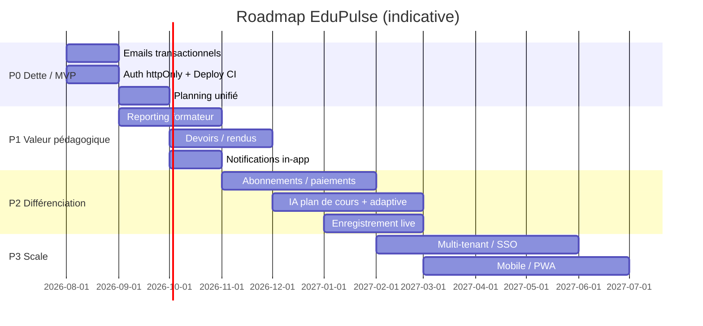

# Cahier des charges — EduPulse LMS

| | |
|---|---|
| **Projet** | EduPulse — Learning Management System |
| **Contexte** | Projet annuel ESGI 2025–2026 |
| **Version document** | 1.0 — 29 juillet 2026 |
| **État produit** | MVP en production (`https://edupulselms.eu`) |
| **Branches** | `feature/*` → `developp` → `main` → VPS |

---

## 1. Objet du document

Ce cahier des charges décrit :

1. **Les fonctionnalités déjà livrées** (état actuel de la plateforme).
2. **Les modules à venir** (roadmap produit / technique).
3. Le **cadre technique** et les **contraintes** d’exploitation.

Il sert de référence pour l’équipe, la soutenance et les évolutions ultérieures.

> Présentation produit + contributeurs Git : [`docs/PRESENTATION_ET_EQUIPE.md`](./PRESENTATION_ET_EQUIPE.md).

---

## 2. Contexte et objectifs

### 2.1 Problématique

Les organismes de formation et formateurs indépendants ont besoin d’une plateforme unique pour :

- publier des parcours structurés (vidéo, texte, PDF, quiz) ;
- suivre la progression des apprenants ;
- animer des sessions live ;
- évaluer et certifier les acquis ;
- s’appuyer sur l’IA pour accélérer la création pédagogique et l’accompagnement.

### 2.2 Objectifs produit

| Objectif | Description |
|---|---|
| O1 | Permettre à un formateur de créer, publier et animer un cours complet |
| O2 | Offrir à l’apprenant un parcours guidé (gating, quiz, examen final, certificat) |
| O3 | Intégrer l’IA côté formateur (génération de quiz) et apprenant (tuteur) |
| O4 | Proposer des classes virtuelles (LiveKit) et une messagerie |
| O5 | Administrer utilisateurs, catégories et publication des cours |
| O6 | Déployer une stack moderne, conteneurisée, avec CI/CD |

### 2.3 Périmètre actuel (MVP livré)

Plateforme web responsive FR/EN, monolithe Nuxt 4, PostgreSQL, Docker, déploiement VPS avec HTTPS (Caddy).

**Hors périmètre MVP (reporté §7)** : abonnements payants, mobile natif, LMS multi-tenant SaaS, SSO entreprise, etc.

---

## 3. Acteurs et rôles

| Rôle | Code | Capacités principales |
|---|---|---|
| **Apprenant** | `APPRENANT` | Catalogue, inscription, player, notes, messages, conférences, certificats, tuteur IA |
| **Formateur** | `FORMATEUR` | Création / édition de cours, quiz IA, conférences LiveKit, réponses Q&A / avis |
| **Administrateur** | `ADMINISTRATEUR` | Stats, utilisateurs, catégories, publication / dépublication des cours |

Un compte peut s’inscrire en apprenant ou formateur. Le rôle administrateur n’est pas créable via l’inscription publique.

---

## 4. Exigences fonctionnelles — modules livrés

Légende : **F** = Formateur · **A** = Apprenant · **Ad** = Admin · **P** = Public

### 4.1 Authentification et compte

| ID | Exigence | Acteurs | Statut |
|---|---|---|---|
| AUTH-01 | Inscription email / mot de passe (APPRENANT ou FORMATEUR) | P | ✅ |
| AUTH-02 | Connexion email / mot de passe (bcrypt) | P | ✅ |
| AUTH-03 | Connexion Google OAuth 2 | P | ✅ |
| AUTH-04 | Session JWT (cookie + Bearer), durée 7 jours | Tous | ✅ |
| AUTH-05 | Déconnexion | Tous | ✅ |
| AUTH-06 | Mot de passe oublié (génération de token) | P | ⚠️ partiel — lien logué en dev, email non envoyé |
| AUTH-07 | Réinitialisation du mot de passe via token | P | ✅ |
| AUTH-08 | Rate limiting login / register / forgot | P | ✅ |
| AUTH-09 | Compte désactivable (`active`) | Ad | ✅ |
| AUTH-10 | Profil utilisateur (nom, avatar, préférences) | Tous | ✅ |
| AUTH-11 | Changement de mot de passe | Tous | ✅ |

### 4.2 Catalogue et découverte

| ID | Exigence | Acteurs | Statut |
|---|---|---|---|
| CAT-01 | Landing marketing | P | ✅ |
| CAT-02 | Catalogue filtrable (catégorie, difficulté, recherche) | P | ✅ |
| CAT-03 | Fiche cours (description, modules, formateur, avis) | P | ✅ |
| CAT-04 | Catégories / sous-catégories | Ad / P | ✅ |
| CAT-05 | Tags, couverture, niveau de difficulté | F | ✅ |
| CAT-06 | Cours public / privé, brouillon / publié | F / Ad | ✅ |

### 4.3 Création de cours (formateur)

| ID | Exigence | Acteurs | Statut |
|---|---|---|---|
| CRS-01 | Parcours en 4 étapes : Infos → Programme → Sessions → Paramètres | F | ✅ |
| CRS-02 | CRUD modules ordonnés | F | ✅ |
| CRS-03 | Leçon **vidéo** (URL YouTube / Vimeo) | F | ✅ |
| CRS-04 | Leçon **texte** (éditeur TipTap) | F | ✅ |
| CRS-05 | Leçon **PDF** (upload) | F | ✅ |
| CRS-06 | Leçon **quiz** QCM (questions / options / bonne réponse) | F | ✅ |
| CRS-07 | Upload média (images, PDF ≤ 20 Mo) | F | ✅ |
| CRS-08 | Publication / paramètres (certificat, visibilité) | F | ✅ |
| CRS-09 | Tableau de bord formateur (cours, feedback) | F | ✅ |

### 4.4 Apprentissage et progression

| ID | Exigence | Acteurs | Statut |
|---|---|---|---|
| LRN-01 | Inscription à un cours publié | A | ✅ |
| LRN-02 | Player de cours (vidéo, texte, PDF, quiz) | A | ✅ |
| LRN-03 | Suivi de progression par leçon + % global | A | ✅ |
| LRN-04 | Gating : module suivant verrouillé si quiz précédent &lt; 70 % | A | ✅ |
| LRN-05 | Quiz de module après les contenus du module | A | ✅ |
| LRN-06 | Examen final après validation de tous les modules | A | ✅ |
| LRN-07 | Dashboard apprenant (cours, activité) | A | ✅ |
| LRN-08 | Liste « Mes cours » | A | ✅ |

### 4.5 Évaluation (quiz & examen final)

| ID | Exigence | Acteurs | Statut |
|---|---|---|---|
| QUIZ-01 | QCM multi-questions, une bonne réponse | F / A | ✅ |
| QUIZ-02 | Soumission quiz module + score | A | ✅ |
| QUIZ-03 | Examen final persisté au niveau cours | F / A | ✅ |
| QUIZ-04 | Soumission examen final + score | A | ✅ |
| QUIZ-05 | Feedback / correction des mauvaises réponses (IA formateur) | F | ✅ |

### 4.6 Intelligence artificielle — formateur

| ID | Exigence | Acteurs | Statut |
|---|---|---|---|
| AIF-01 | Génération de quiz depuis une vidéo YouTube (transcription → OpenAI) | F | ✅ |
| AIF-02 | Fallback : si transcription inaccessible, analyse vidéo via **Gemini** | F | ✅ |
| AIF-03 | Collage manuel de transcription (secours) | F | ✅ |
| AIF-04 | Relecture / édition des questions avant enregistrement | F | ✅ |
| AIF-05 | Génération de l’examen final à partir du contenu des modules | F | ✅ |
| AIF-06 | Enrichissement examen final : résumé vidéo (transcript ou Gemini) | F | ✅ |

### 4.7 Intelligence artificielle — apprenant

| ID | Exigence | Acteurs | Statut |
|---|---|---|---|
| AIA-01 | Tuteur IA contextuel à la leçon (expliquer) | A | ✅ |
| AIA-02 | Chat d’aide pédagogique | A | ✅ |
| AIA-03 | Mini-quiz d’entraînement généré par l’IA | A | ✅ |
| AIA-04 | Garde-fous anti-spoiler sur les quiz notés | A | ✅ |

### 4.8 Conférences live (LiveKit)

| ID | Exigence | Acteurs | Statut |
|---|---|---|---|
| LIVE-01 | CRUD conférences (titre, description, date) | F | ✅ |
| LIVE-02 | Inscription / désinscription apprenant | A | ✅ |
| LIVE-03 | Démarrage / fin de session | F | ✅ |
| LIVE-04 | Salle virtuelle audio/vidéo (LiveKit Cloud) | F / A | ✅ |
| LIVE-05 | Demande de parole (« lever la main ») + grant | F / A | ✅ |
| LIVE-06 | Rappels email ~15 min avant le live | Système | ✅ |

### 4.9 Messagerie

| ID | Exigence | Acteurs | Statut |
|---|---|---|---|
| MSG-01 | Conversations 1–1 | A / F | ✅ |
| MSG-02 | Liste des non-lus | A / F | ✅ |
| MSG-03 | Recherche d’utilisateurs | A / F | ✅ |
| MSG-04 | Temps réel WebSocket (`/ws/messages`) | A / F | ✅ |

### 4.10 Certificats

| ID | Exigence | Acteurs | Statut |
|---|---|---|---|
| CERT-01 | Émission après complétion (et score si applicable) | A | ✅ |
| CERT-02 | Code unique + niveaux / mentions | A | ✅ |
| CERT-03 | Liste des certificats, aperçu, export PDF | A | ✅ |
| CERT-04 | Option `hasCertificate` à la publication du cours | F | ✅ |

### 4.11 Notes personnelles

| ID | Exigence | Acteurs | Statut |
|---|---|---|---|
| NOTE-01 | CRUD notes liées à un cours / une leçon | A | ✅ |
| NOTE-02 | Éditeur riche TipTap + tags | A | ✅ |

### 4.12 Avis, Q&A et feedback

| ID | Exigence | Acteurs | Statut |
|---|---|---|---|
| SOC-01 | Avis cours (note + commentaire) | A | ✅ |
| SOC-02 | Discussion par leçon (fil de commentaires) | A / F | ✅ |
| SOC-03 | Réponses formateur aux questions / avis | F | ✅ |
| SOC-04 | Page feedback formateur | F | ✅ |

### 4.13 Administration

| ID | Exigence | Acteurs | Statut |
|---|---|---|---|
| ADM-01 | Dashboard statistiques | Ad | ✅ |
| ADM-02 | Gestion utilisateurs (rôle, actif) | Ad | ✅ |
| ADM-03 | CRUD catégories | Ad | ✅ |
| ADM-04 | Publication / dépublication de cours | Ad | ✅ |

### 4.14 Internationalisation & UX

| ID | Exigence | Acteurs | Statut |
|---|---|---|---|
| UX-01 | Interface bilingue FR / EN | Tous | ✅ |
| UX-02 | Contrôle CI de parité des clés i18n | Dev | ✅ |
| UX-03 | Layout responsive (desktop / mobile) | Tous | ✅ |
| UX-04 | Sidebar mobile | Tous | ✅ |

### 4.15 Notifications email

| ID | Exigence | Acteurs | Statut |
|---|---|---|---|
| MAIL-01 | Infrastructure SMTP / Mailpit | Système | ✅ |
| MAIL-02 | Rappels de conférence | Système | ✅ |
| MAIL-03 | Email de reset password | Système | ⚠️ à finaliser |
| MAIL-04 | Alertes de connexion (`loginAlerts`) | Système | ⚠️ préférence stockée, envoi absent |

---

## 5. Exigences non fonctionnelles

| ID | Domaine | Exigence |
|---|---|---|
| NF-01 | Performance | Temps de réponse API nominal &lt; 2 s hors appels IA externes |
| NF-02 | Disponibilité | Stack Docker redémarrable ; healthcheck app |
| NF-03 | Sécurité | RBAC, JWT, bcrypt, rate limit auth, whitelist uploads |
| NF-04 | Confidentialité | Secrets hors git (`.env` VPS) ; `.env` exclu du rsync deploy |
| NF-05 | Qualité | CI : Prisma validate, i18n, unitaires, build, tests intégration |
| NF-06 | Maintenabilité | Monolithe Nuxt documenté ; migrations Prisma versionnées |
| NF-07 | Scalabilité MVP | Déploiement mono-VPS ; LiveKit Cloud pour la charge A/V |
| NF-08 | Accessibilité | Amélioration progressive (contrastes, labels) — chantier ouvert |

**Point d’attention sécurité :** le cookie de session est lisible en JavaScript (`httpOnly: false`) pour faciliter le front. Une évolution vers cookie `httpOnly` + refresh token est recommandée (§7).

---

## 6. Architecture technique

### 6.1 Stack

| Couche | Technologie |
|---|---|
| Frontend / API | Nuxt 4 (Vue 3) + Nitro |
| État client | Pinia |
| Styles | Tailwind CSS |
| Éditeur riche | TipTap |
| ORM / BDD | Prisma 7 + PostgreSQL 15 |
| Auth | JWT + Google OAuth |
| Temps réel | WebSocket Nitro (messages) ; LiveKit (visio) |
| IA | OpenAI (quiz, tuteur) ; Google Gemini (analyse vidéo) |
| Email | Nodemailer + Mailpit (dev / catcher prod) |
| PDF | PDFKit / jsPDF (certificats) |
| Conteneurs | Docker Compose (dev & prod) |
| Reverse proxy | Caddy (HTTPS Let’s Encrypt) |
| CI/CD | GitHub Actions (`ci.yml`, `auto-pr-main.yml`, `deploy.yml`) |

### 6.2 Environnements

| Env | URL / accès | Compose |
|---|---|---|
| Local | `http://localhost:3000` | `docker-compose.yml` |
| Production | `https://edupulselms.eu` | `docker-compose.prod.yml` |

### 6.3 Flux de livraison

```
feature/*  →  PR  →  developp  →  auto PR/merge  →  main  →  Deploy VPS
```

### 6.4 Structure dépôt (principale)

```
app/                 # Pages, composants, middleware, stores
server/api/          # Endpoints REST
server/utils/        # Métier (auth, IA, certificats, gating…)
server/routes/ws/    # WebSocket messages
prisma/              # Schéma, migrations, seed
i18n/locales/        # FR / EN
docker/              # Dockerfiles, Caddy, entrypoints
.github/workflows/   # CI, release, deploy
tests/               # Unit / integration / functional
docs/                # Documentation projet
```

---

## 7. Modules à venir (roadmap)

Priorisation indicative : **P0** critique / dette · **P1** forte valeur · **P2** différenciation · **P3** long terme.

### 7.1 Finalisation du MVP (P0)

| Module | Description | Justificatif |
|---|---|---|
| **Email transactionnel complet** | Reset password, vérification email, alertes de connexion | Sécurité & confiance compte |
| **Cookie session httpOnly** | Migration auth (cookie sécurisé + éventuellement refresh) | Réduction risque XSS |
| **Planning unifié** | Remplacer la page « en construction » (`/schedule`) par agenda cours + lives | Cohérence UX promise |
| **Stabiliser Deploy Actions** | Corriger `VPS_SSH_KEY` / sync rsync pour CD 100 % automatique | Fiabilité livraison |
| **SMTP réel en prod** | Remplacer / compléter Mailpit catcher par un fournisseur (Brevo, SES…) | Emails réellement reçus |

### 7.2 Pédagogie & suivi (P1)

| Module | Description |
|---|---|
| **Reporting formateur** | Tableaux de bord : progression classe, scores quiz, abandons (dossier API `reporting/` stub) |
| **Analytics apprenant** | Temps passé, leçons difficiles, recommandations de révision |
| **Banques de questions** | Réutilisation de QCM entre cours ; import CSV |
| **SCORM / xAPI (léger)** | Export d’activité pour LRS ou LMS tiers |
| **Devoirs / rendus** | Remise de fichiers, notation manuelle formateur |
| **Peer review** | Évaluation croisée d’exercices |

### 7.3 Live & collaboration (P1–P2)

| Module | Description |
|---|---|
| **Enregistrement de session** | Replay des conférences LiveKit |
| **Chat de salle + tableau blanc** | Collaboration pendant le live |
| **Breakout rooms** | Sous-groupes en classe virtuelle |
| **Calendrier iCal / Google** | Sync des lives et deadlines |

### 7.4 Monétisation & croissance (P2)

| Module | Description |
|---|---|
| **Plan Premium / abonnements** | Libellés déjà présents en nav — backend + Stripe / PayPal |
| **Paiement à la carte** | Achat d’un cours unitaire |
| **Coupons & promotions** | Codes promo formateur / admin |
| **Marketplace formateurs** | Commission plateforme, vitrine publique enrichie |
| **Stockage média cloud** | S3-compatible pour vidéos hébergées (au-delà de YouTube) |

### 7.5 IA avancée (P2)

| Module | Description |
|---|---|
| **Génération de plan de cours** | Brief → modules / leçons suggérés |
| **Sous-titrage / résumé auto** | Pour vidéos uploadées |
| **Détection de décrochage** | Alerte formateur si inactivité |
| **Adaptive learning** | Parcours personnalisé selon scores |
| **Modération automatique** | Q&A / avis (toxicité) |

### 7.6 Administration & entreprise (P2–P3)

| Module | Description |
|---|---|
| **Multi-tenant / organisations** | Espaces école / entreprise isolés |
| **SSO (SAML / OIDC)** | Connexion entreprise |
| **RBAC fin** | Rôles custom, permissions granulaires |
| **Audit log** | Traçabilité actions sensibles |
| **RGPD** | Export / suppression des données personnelles (self-service) |
| **Back-office reporting BI** | Exports CSV, graphes avancés |

### 7.7 Expérience & qualité (P1–P3)

| Module | Description |
|---|---|
| **PWA / mode hors-ligne léger** | Consultation notes / PDF hors ligne |
| **Application mobile** | React Native / Flutter (lecture + notifications) |
| **Accessibilité WCAG 2.1 AA** | Audit + corrections |
| **Notifications in-app** | Centre de notifications (live, message, certificat) |
| **Recherche globale** | Cours, leçons, notes, messages |
| **Tests E2E Playwright** | Scénarios critiques (auth, enroll, quiz, live) |

### 7.8 Cartographie roadmap (vue synthétique)



---

## 8. Contraintes et hypothèses

1. **Hébergement** : VPS unique (OVH/autre) ; LiveKit en Cloud.
2. **Médias vidéo** : principalement liens YouTube/Vimeo (pas d’encodage maison en MVP).
3. **IA** : dépend de clés `OPENAI_API_KEY` et `GEMINI_API_KEY` ; coûts d’usage à surveiller.
4. **Langues** : FR (défaut) et EN ; autres langues hors MVP.
5. **Seed** : données de démo uniquement en environnement non productif (seed destructif).
6. **Conformité** : mise en conformité RGPD complète prévue en P2–P3.

---

## 9. Critères d’acceptation globaux (MVP)

Le MVP est considéré **accepté** si :

- [x] Les trois rôles fonctionnent avec auth email et Google.
- [x] Un formateur peut publier un cours multi-types de leçons + quiz + examen final.
- [x] Un apprenant peut s’inscrire, progresser avec gating, passer l’examen et obtenir un certificat.
- [x] La génération IA de quiz (YouTube ± Gemini) et le tuteur apprenant sont opérationnels.
- [x] Une conférence LiveKit peut être créée et rejointe.
- [x] La messagerie temps réel fonctionne.
- [x] L’admin gère users / catégories / publication.
- [x] L’interface est disponible en FR et EN.
- [x] La CI passe (build + tests) et une instance prod est joignable en HTTPS.

---

## 10. Glossaire

| Terme | Définition |
|---|---|
| **Gating** | Verrouillage pédagogique conditionné au score / complétion |
| **Curriculum** | Structure modules → leçons d’un cours |
| **Examen final** | Quiz transversal de validation du cours |
| **LiveKit** | Infrastructure WebRTC pour classes virtuelles |
| **Mailpit** | Catcher SMTP de développement / préprod |
| **Nitro** | Serveur API intégré à Nuxt |

---

## 11. Historique du document

| Version | Date | Auteur | Modifications |
|---|---|---|---|
| 1.0 | 29/07/2026 | Équipe EduPulse | Création — inventaire livré + roadmap modules à venir |

---

*Document généré à partir de l’état du dépôt `developp` / `main` et de la production `edupulselms.eu`.*
